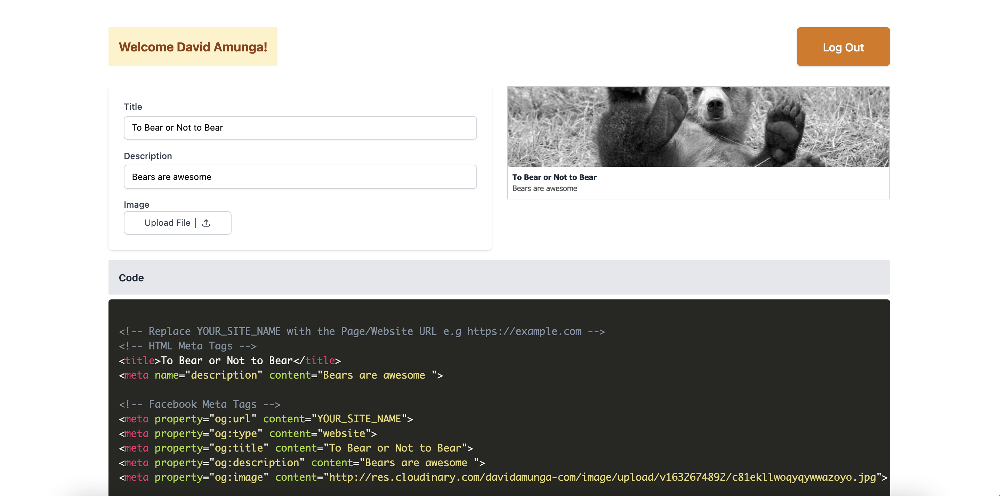

# Site Previewer App

This is a web app that makes preparing for social media link previews for your site simpler by entering key metadata like `title,description,image`. It uses [Auth0](https://auth0.com/) for Authentication and [Cloudinary](https://cloudinary.com/) for Image Uploads.

You can find the CodeSandbox for this project [here.](https://codesandbox.io/s/auth0-cloudinary-react-m2y1q)

## Screenshots



<br/>
<br/>

## Run Locally
---
Clone the project

```bash
git clone https://github.com/DavidAmunga/site-preview-app-tutorial.git
```

Go to the project directory

```bash
  cd site-preview-app-tutorial
```

Fill in the values from Cloudinary and Auth0 in your `.env` file

```bash
REACT_APP_AUTH_CLIENT_ID=
REACT_APP_AUTH_DOMAIN=
REACT_APP_CLOUDINARY_UPLOAD_PRESET=
REACT_APP_CLOUDINARY_CLOUD_NAME=
```

Install dependencies

```bash
  npm install
```

Run your project

```bash
  npm run start
```

## Deploy to Netlify
---
If you want to see the project live once deployed you can deploy to Netlify. Remember to add your Environment Variables


<hr/>

## Technologies used
---
- [React](https://reactjs.org)
- [TailwindCSS](https://tailwindcss.com)
- [Auth0](https://auth0.com)
- [Cloudinary](https://cloudinary.com)
- [PrismJS](https://www.npmjs.com/package/prismjs) - Syntax Highliting for the CodeBlocks

## Contributing
---
Pull requests are welcome. For major changes, please open an issue first to discuss what you would like to change.

## License
---
[MIT](https://choosealicense.com/licenses/mit/)
